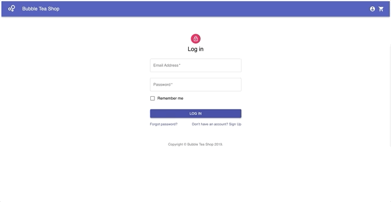
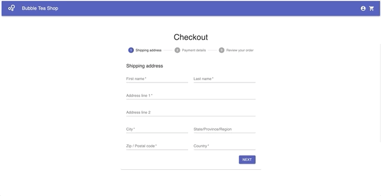

<p align="center">
  <a href="" rel="noopener">
 </a>
</p>

<h3 align="center">Bubble Tea Shop</h3>

<div align="center">

[]()
[](/LICENSE)

</div>

---

<p align="center"> A simple online ordering website built with <b>React.js</b>, <b>Redux</b>, <b>Hooks</b>, and <b>Material-UI</b>.
<br/>
<a src="https://online-order-milk-tea.herokuapp.com/" >https://online-order-milk-tea.herokuapp.com/</p>
</p>


## 📝 Table of Contents

- [About](#about)
- [Demo](#demo)
- [How it works](#working)
- [Getting Started](#getting_started)
- [Authors](#authors)

## 🧐 About <a name = "about"></a>

"Bubble Tea Shop" is an easy-to-use online ordering system that serves nice UI and outstanding UX. It is a single page application create dwith latest front-end and back-end technologies. It provides diverse functionalities including Login, Logout, Register, Select Items, Checkout, and Review orders.

## 🎥 Demo <a name = "demo"></a>

### Demo Website (Heroku): https://online-order-milk-tea.herokuapp.com/
- Demo Username: olishay517@gmail.com
- Demo Passwords: 123456

### 💿 Register a New User
<br/>


### 📀 Make a New Order
<br/>


### 💾 Check Out
<br/>


### 💽 Review My Orders
<br/>


## 💭 How it works <a name = "working"></a>

- Worked with Team Lead, Web Developers via Agile methodologies (Scrum, Kanban) to complete the project within the 4week deadline.
- Mainly responsible for implementing front-end design and function realization.
- Applied HTML5 for the structure creation and Material UI for CSS design.
- Followed principles of single responsibility and reusability,  employed React to decompose the UI into a component hierarchy.
- Used the state management tool Redux together with React to centralize state. Also, enabled some useful features like time-travel debugging to rewind and inspect program state.
- Assisted with building the back-end server and the connection to the database, using Node.js and MongoDB.
- Based on HTTP, implemented RESTful API design for handling client requests and server responses.
- Validated user identity by adding JWT token based authentication into the SPA, encoding a token during the process of client and server communication.

## 🏁 Getting Started <a name = "getting_started"></a>

These instructions will get you a copy of the project up and running on your local machine for development and testing purposes.

### 🔧 Prerequisites

What things you need to install the software and how to install them.

```
Node
React
MongoDB
```

### ⚙️  Setup [MongoDB](https://www.mongodb.com/)

Change the secret key of your own MongoDB
At **/server/config/config.env**

```
MONGO_URI={YOUR_MONGODB_CONNECT_KEY}
```

### ⛏️ Installing

At root folder
```
npm install
npm start
```

At **/server** folder
```
npm install
npm run dev
```

## ✍️ Authors <a name = "authors"></a>

- [@Olivia](https://github.com/mxue2) - Idea & Initial work
